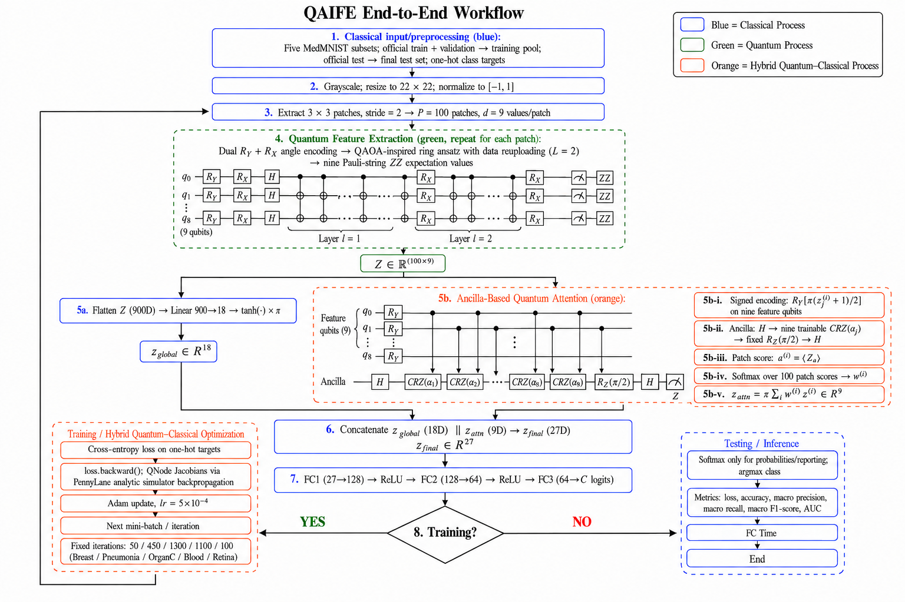

# QAIFE Medical Image Classification

Official public implementation of **QAIFE (Quantum Attention Inspired Feature Extraction)** for the five MedMNIST image-classification experiments reported in the manuscript.

> **Repository scope:** this repository releases only the QAIFE implementation. Comparative QFE and CNN implementations are not included.

## Method overview

QAIFE combines patchwise quantum feature extraction, an ancilla-based quantum-attention branch, feature concatenation, and a classical fully connected classifier. The repository follows the manuscript protocol at a practical code level; the paper contains the complete mathematical definitions, analyses, and result tables.



## Notebooks

| Sub-dataset | Notebook | Run in Google Colab |
|---|---|---|
| BreastMNIST | [`QAIFE_Medical_Image_BreastMNIST.ipynb`](notebooks/QAIFE_Medical_Image_BreastMNIST.ipynb) | [](https://colab.research.google.com/github/vanbabenk/QAIFE-Medical-Image-Classification/blob/main/notebooks/QAIFE_Medical_Image_BreastMNIST.ipynb) |
| PneumoniaMNIST | [`QAIFE_Medical_Image_PneumoniaMNIST.ipynb`](notebooks/QAIFE_Medical_Image_PneumoniaMNIST.ipynb) | [](https://colab.research.google.com/github/vanbabenk/QAIFE-Medical-Image-Classification/blob/main/notebooks/QAIFE_Medical_Image_PneumoniaMNIST.ipynb) |
| OrganCMNIST | [`QAIFE_Medical_Image_OrganCMNIST.ipynb`](notebooks/QAIFE_Medical_Image_OrganCMNIST.ipynb) | [](https://colab.research.google.com/github/vanbabenk/QAIFE-Medical-Image-Classification/blob/main/notebooks/QAIFE_Medical_Image_OrganCMNIST.ipynb) |
| BloodMNIST | [`QAIFE_Medical_Image_BloodMNIST.ipynb`](notebooks/QAIFE_Medical_Image_BloodMNIST.ipynb) | [](https://colab.research.google.com/github/vanbabenk/QAIFE-Medical-Image-Classification/blob/main/notebooks/QAIFE_Medical_Image_BloodMNIST.ipynb) |
| RetinaMNIST | [`QAIFE_Medical_Image_RetinaMNIST.ipynb`](notebooks/QAIFE_Medical_Image_RetinaMNIST.ipynb) | [](https://colab.research.google.com/github/vanbabenk/QAIFE-Medical-Image-Classification/blob/main/notebooks/QAIFE_Medical_Image_RetinaMNIST.ipynb) |

Each notebook is self-contained. `RUN_MODE = "single"` is the default for a quick independent run. Select `RUN_MODE = "five"` to execute the main five-run protocol reported in the paper. Seeds are generated automatically in both modes; there is no manual-seed setting.

## Experimental configuration

- Protocol name: **QAIFE Medical Image**
- Compute device: CPU for the quantum components and fully connected classifier
- Input preprocessing: grayscale, resize to 22 × 22, normalize to [-1, 1]
- Patch extraction: 3 × 3 kernel, stride 2, 100 patches per image
- Mini-batch size: 64
- Optimizer: Adam with learning rate 0.0005
- Main reporting protocol: mean and sample standard deviation over five independent runs
- `FC Time`: isolated training benchmark of the learned fully connected classifier using 50 warm-up updates and 1,000 timed Adam training updates; values are reported in seconds to two decimal places

| Sub-dataset | Fixed training iterations per run |
|---|---:|
| BreastMNIST | 50 |
| PneumoniaMNIST | 450 |
| OrganCMNIST | 1300 |
| BloodMNIST | 1100 |
| RetinaMNIST | 100 |

## Dataset

The experiments use the official 28 × 28 MedMNIST v2 sub-datasets BreastMNIST, PneumoniaMNIST, OrganCMNIST, BloodMNIST, and RetinaMNIST. The notebooks download the data through the MedMNIST resources and use the official train/validation/test partitions.

- [MedMNIST official website](https://medmnist.com/)
- [MedMNIST official source repository](https://github.com/MedMNIST/MedMNIST)

MedMNIST states that the benchmark is intended for research and education and is not intended for clinical use. Consult the official source for dataset-specific licenses and citations.

## Run in Google Colab

1. Open the required sub-dataset using its **Open in Colab** badge above.
2. Keep `RUN_MODE = "single"` for one automatically seeded run, or select `"five"` for the paper protocol.
3. Choose **Runtime → Run all**. The dependency cell installs missing packages automatically.
4. The final cell reports metrics and `FC Time`, then saves the training curve and confusion matrix under `outputs/<Sub-dataset>/`.

Quantum simulation can be computationally demanding on CPU. The five-run mode therefore takes substantially longer than the default single run.

## Run locally

Python 3.13 was used for the reported experiments.

```bash
git clone https://github.com/vanbabenk/QAIFE-Medical-Image-Classification.git
cd QAIFE-Medical-Image-Classification
python -m venv .venv
```

Activate the environment:

```bash
# Windows PowerShell
.venv\Scripts\Activate.ps1

# macOS or Linux
source .venv/bin/activate
```

Install the dependencies and launch Jupyter:

```bash
python -m pip install --upgrade pip
python -m pip install -r requirements.txt
jupyter lab
```

Open one notebook from `notebooks/` and run all cells in order.

## Repository layout

```text
.
├── README.md
├── requirements.txt
├── assets/
│   └── QAIFE_End_to_End_Workflow.png
├── notebooks/
│   └── QAIFE_Medical_Image_<Sub-dataset>.ipynb
└── outputs/
    └── <Sub-dataset>/
        ├── QAIFE_<Sub-dataset>_Training.png
        └── QAIFE_<Sub-dataset>_Confusion_Matrix.png
```

The figures in `outputs/` are representative training curves and confusion matrices. Complete numerical tables and experimental discussion are provided in the manuscript.

## Related Manuscript

This repository accompanies the manuscript:

**“Novel Quantum Attention Inspired Feature Extraction for Efficient Medical Image Classification.”**
Ifran Lindu Mahargya, Guruh Fajar Shidik, Affandy, Pujiono, Supriadi Rustad, Hermawan Kresno Dipojono

The manuscript is currently under peer review.

Publication link: The complete journal citation, publication link, and article DOI will be added after publication in *Multimedia Tools and Applications - Springer*.

## License

The QAIFE source code in this repository is released under the MIT License. See the [LICENSE](LICENSE) file for details. MedMNIST datasets and third-party dependencies remain subject to their respective licenses.

## Notes

- This repository is research software and is not intended for clinical use.
- Do not commit downloaded datasets, checkpoints, or ad hoc result exports.
- The public notebooks intentionally display only the outputs necessary for QAIFE evaluation and figure generation.
